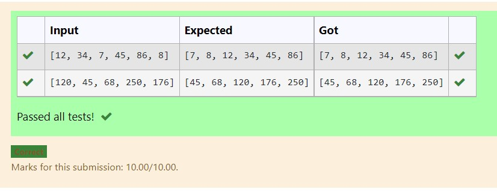
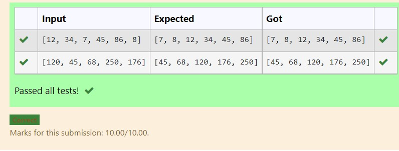

# Selection sort and Insertion sort
## Aim:
To write a program to perform selection sort and insertion sort using python programming.
## Equipment’s required:
1.	Hardware – PCs
2.	Anaconda – Python 3.7 Installation / Moodle-Code Runner
## Algorithm:
## Selection Sort Algorithm:
1.	Set the first unsorted element as the minimum
2.	For each of the unsorted elements, check if the element < current minimum.
3.	If yes, set the element as the new minimum.
4.	Swap minimum with first unsorted position.
5.	Repeat the steps 2 and 3 for all the elements in the array.
## Insertion Sort Algorithm:
1.	Set the first element as sorted element j.
2.	For each unsorted element X, check if current sorted element j >X.
3.	If yes, move sorted element to the right by 1.
4.	Break the loop and insert X.
5.	Repeat the steps 2 to 4 for sorting all the elements in the array.
## Program:
i)	#Selection Sort
```
def selection_sort(nums):
    # write your code here using selection sort
    for i in range(len(nums)):
        low_index=i
        for j in range(i+1,len(nums)):   #i=1    j=2
            if nums[j]<nums[low_index]:
                low_index=j
        nums[i],nums[low_index]=nums[low_index],nums[i]
    return nums
    
    
    
list_of_nums = eval(input())
# use the selection sort function
value=selection_sort(list_of_nums)
# print the sorted list
print(value)


```
ii)	#Insertion Sort
```
def insertion_sort(nums):
    # Write your code here to sort the elements in the list using Insertion sort algorithm
    for i in range(1,len(nums)):
        item=nums[i]
        j=i-1
        while j>=0 and nums[j]>item:
            nums[j+1]=nums[j]
            j-=1
        nums[j+1]=item
    return nums
list_of_nums = eval(input())
# use the insertion sort function to get the sorted list
value=insertion_sort(list_of_nums)
# print the sorted list
print(value)


```

## Output:

### OUTPUT1:


### OUTPUT2:



## Result:
Thus the program is written to perform selection sort and insertion sort using python programming.
